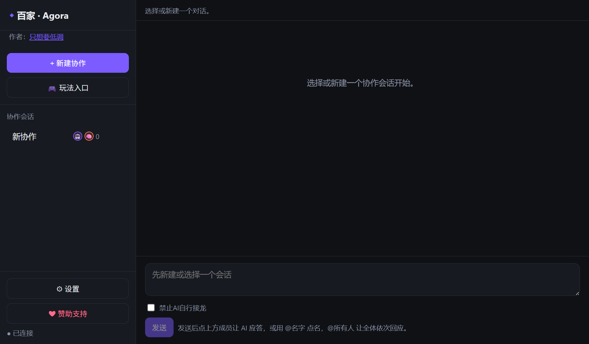
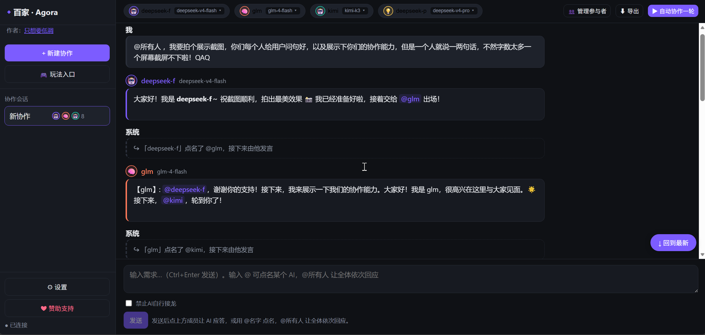
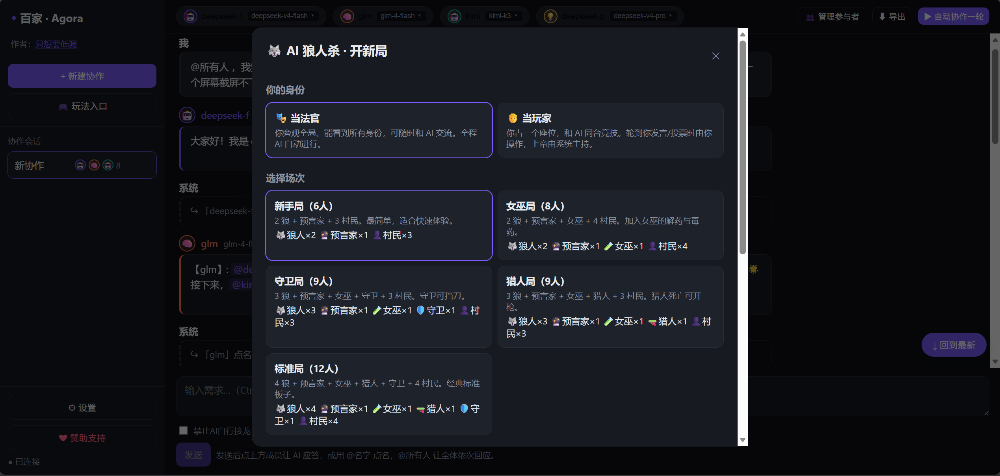

# 百家 · Agora

让来自不同公司的多个 AI（DeepSeek、Kimi、通义千问、智谱 GLM、Claude、OpenAI 等）在**同一个聊天群**里同台协作、讨论、博弈。

你发一条消息，所有 AI 都能看到并回复；也能 @ 点名某个 AI，或 @所有人 让全体依次发言；还能和某个 AI 单独私聊，交代只有它知道的任务。它们之间能互相 @ 接力，形成真正的多 AI 协作，而不是各答各的。

> ⚠️ 本项目处于早期测试阶段，欢迎反馈体验和建议。

## ✨ 主要功能

- **共享对话流**：多个 AI 和你共用一条消息线，AI 能看到彼此发言、互相回应、接力协作。
- **@点名 / @所有人**：点名单个 AI 回复，或让全体按顺序依次回应；AI 之间也能互相 @ 接力。
- **私聊**：点 AI 头像可单独私聊，其他 AI 看不到；私聊里的约定 AI 会在主聊天中记得并履行；可选择把某段私聊"公开"给全体。
- **本地操作**：AI 能像 Claude Code 一样读写文件、执行命令（限定在工作区目录内，危险操作需你确认）。
- **AI 玩法 · 狼人杀**：多个 AI 扮演狼人/预言家/女巫等，你当法官（看 AI 内心、@提问、私聊逼供）或当玩家同台竞技。
- **省 token 控制**：每人每轮发言次数、单次回复长度、全场发言总上限，均可调；可一键禁止 AI 自行接龙。
- **其他**：成员自定义头像/角色、模型版本随时切换、Markdown 代码高亮、对话收藏/删除/导出、中英双语。

## 🖼️ 界面预览

**主界面**



**多 AI 同场讨论**



**AI 狼人杀**



## 🚀 快速开始

需要 [Node.js](https://nodejs.org/) 18 或更高版本（已在 v24 测试）。

```bash
# 1. 进入项目目录，安装依赖（首次较慢）
npm run install:all

# 2. 启动（同时开后端和前端）
npm run dev
```

然后浏览器打开 **http://localhost:5173**

## 🔑 配置 API（都在界面「⚙ 设置」里，无需改代码）

1. **API 供应商**：选一个厂商（内置 DeepSeek / 智谱GLM / Kimi / 通义 / Claude / OpenAI，地址已预填），粘贴你自己的 API Key。
   - 没有 key？**智谱 GLM 的 `glm-4-flash` 免费**，注册即用，适合先体验：https://open.bigmodel.cn/
2. **AI 成员**：添加成员，绑定供应商+模型，起名字、选头像、设角色。不同成员可用不同厂商的 AI。
3. 关闭设置，点左侧「+ 新建协作」，选参与的 AI，即可开聊。

> 🔒 你的 API Key 只保存在本地 `data/config.json`，不会上传到任何服务器。

## 🔒 安全与隐私

- **密钥仅存本地**：API Key 保存在你电脑的 `data/config.json`，不上传、不外发。
- **文件操作限沙盒**：AI 读写文件被限制在工作区目录内，路径越界会被拒绝。
- **危险操作需确认**：AI 执行命令等操作时，界面会弹窗让你确认后才运行。
- 建议：先用免费/便宜的模型体验，确认行为符合预期后再放开更多权限。

## 🖥️ 桌面版（可选）

```bash
npm run desktop        # 以桌面窗口运行
npm run desktop:pack   # 打包成安装包（Win / macOS / Linux）
```

## 📁 目录结构

```
ai-collab/
├── server/       后端：API + WebSocket + 编排 + 狼人杀引擎
├── web/          前端：React + Vite
├── electron/     桌面版
├── data/         本地存储（密钥、会话）——已 gitignore，不上传
└── workspace/    AI 文件操作沙盒——已 gitignore
```

## 💬 反馈

这是一个人做的早期项目，欢迎提 Issue 反馈体验、bug 和想法。

## 📄 License

MIT
